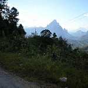

# Intel Image Classification Dataset Using PyTorch
- Image classification using CNN PyTorch format of Intel Image Classification dataset
- Link to Dataset : https://www.kaggle.com/datasets/puneet6060/intel-image-classification
- The model achieved a training accuracy of 98.76% and a testing accuracy of 79.50% without doing any parameter tuning

## The Dataset Information
- Consist of image data of Natural Scenes around the world.
- This Data contains around 25k images of size 150x150 distributed under 6 categories.
1. Buildings

     
2. Forest

     
3. Glacier

     
4. Mountain

     
5. Sea

6. Street
   

## Training Results
- The settings of the image size can be tuned depending on your experiments
- This code takes the image into 224x224 size image

1. Training Accuracy

2. Testing Acccuracy

## Testing Results
- Inference was done using the Intel_CNN_Inference.ipynb script in this repo
- There are 2 options to output the inference
  > Pie Chart  
  > Bar Plot
- There are also 2 preprocessing in the test folder which are
   > Masking the Image  
   > Unmasking the Image (normal)
- Refer to https://github.com/AimanHadif/Image-Masking for details on Masked Image
- Example output will produce the file for class and the each image predicted in the class, the visualization (pie/bar), and csv file of the filename and the predicted label
  

1. Pie w/ Mask
   
2. Pie w/o Mask
   
3. Pie (Both Mask and No Mask)
   
4. Bar w/ Mask
   
5. Bar (Both Mask and No Mask)
    

## Error
- There should not be any error unless you've changed the input size, and the number of class. If that is the case then refer back to the CNN architecture to adjust the output number and the image size on the final layer
- If you found any error while implementing this code with different datasets. Please understand the code completely especially in the inference script
- If the error is still unsolvalbe, feel free to reach me
